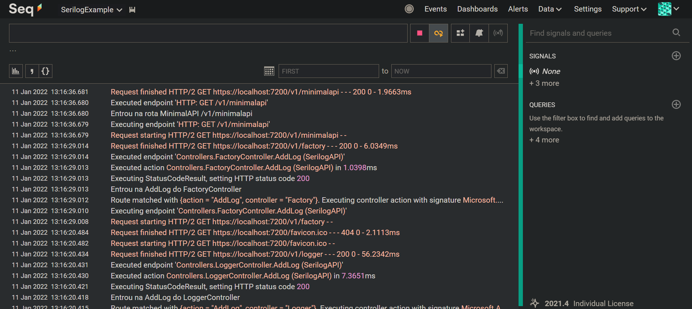

# Serilog

O **Serilog** é um framework que fornece registro de diagnóstico ou *Logging* para arquivos, db, console e em outros formatos, facilitando a criação de registros de logs; é fácil de configurar, tem uma API limpa e é portátil entre as plataformas .NET.

Podemos instalar o Serilog no .NET 6 via NuGet com `dotnet add package Serilog.AspNetCore`. Porém, precisamos de alguns pacotes chamados de coletores ou **Sinks**: os coletores são as configurações do local de armazenamento dos logs. Veja alguns **Sinks**:

- `dotnet add package Serilog.Sinks.Console` para exibir o log no console;
- `dotnet add package Serilog.Sinks.File` para salvar em um arquivo;
- `dotnet add package Serilog.Sinks.Seq` para utilizar o Seq;
- `dotnet add package Serilog.Sinks.MSSqlServer` para salvar no banco de dados SQLServer.

O desenvolvedor precisa incluir todos os pacotes de **Sinks** que deseja utilizar, lembrando, que podemos registrar o log em mais de um provedor ao mesmo tempo.

> 💡 Nesse link podemos ver todos os **Sinks** disponíveis pelo **Serilog**: [https://github.com/serilog/serilog/wiki/Provided-Sinks](https://github.com/serilog/serilog/wiki/Provided-Sinks).

# 1. Níveis de Log

O **Serilog** contém os seguintes níveis de log:

- **Verbose**: É o mais ruidoso, raramente (ou nunca) é habilitado para um aplicativo de produção. Descreve informações detalhadas de debug e rastreamento;
- **Debug**: descreve informações de debug e fluxo da aplicação (eventos internos). É mais usado para eventos internos do sistema que não são necessariamente observáveis de fora, mas são úteis para determinar como algo aconteceu;
- **Information**: registra eventos de interesse e relevância (funções do sistema). Descrevem coisas que acontecem no sistema que correspondem às suas responsabilidades e funções. Geralmente, essas são as ações observáveis que o sistema pode realizar;
- **Warning**: registra informações de possíveis problemas e comportamentos inesperados;
- **Error**: registra informações de falha de qualquer tipo; usado em exceções;
- **Fatal**: registra erros críticos que comprometam a aplicação de forma completa.

# 2. Configurando o Serilog ao projeto

Para utilizar o **Serilog** no .NET 6 devemos fazer a inclusão/configuração no Program do projeto.

- Inicialmente devemos excluir todos os provedores existentes de log, e isso pode ser feito com o comando `builder.Logging.ClearProviders()`;
- Agora partiremos para configurar o **Serilog** criando uma instância de `LoggerConfiguration()`. É aqui que serão feitas as configurações das características de *log*. Veremos no bloco de código abaixo como fica essa configuração;
- Após criar a instância de `LoggerConfiguration`, devemos incluir o **Serilog** como provedor de *logging* com o comando `builder.Logging.AddSerilog(logger)`, sendo `logger` a instância criada acima.

Veja as configurações:

```csharp
using Serilog;

var builder = WebApplication.CreateBuilder(args);

// Remove default logging providers
builder.Logging.ClearProviders();

// Serilog configuration		
var logger = new LoggerConfiguration()
    .WriteTo.Console()
    .WriteTo.File("logs/log.txt", rollingInterval: RollingInterval.Day)
    .WriteTo.Seq("http://localhost:5341/")
    .CreateLogger();

// Register Serilog
builder.Logging.AddSerilog(logger);

// Add Controllers
builder.Services.AddControllers();

var app = builder.Build();

// Map Controllers
app.MapControllers();

app.MapGet("/v1/minimalapi", (ILoggerFactory loggerFactory) => {
    var logger = loggerFactory.CreateLogger("MinimalAPI Log");
    logger.LogInformation("Entrou na rota MinimalAPI /v1/minimalapi");
});

app.Run();
```

## 2.1. Configurando

Ao criar a instância de `LoggerConfiguration` existem algumas configurações a serem feitas para possibilitar o funcionamento do **Serilog**:

1. A principal delas é o `CreateLogger()` que a partir desse momento que é criado o *logger*. 

2. Além dela temos o `WriteTo` que serão os **Sinks** configurados para exibir o **log**. Nesse projeto:
    - É configurado o *log* para aparecer no console com `.WriteTo.Console()`;
    - O `.WriteTo.File("filepath/file.txt", rollingInterval: RollingInterval.Day)` também é configurado, para exibir em um arquivo. Nele é possível ainda:
        - Informar se deseja dividir o log (em vários arquivos) em determinada quantidade de tempo com `rollingInterval: RollingInterval.Day` onde as alternativas são:
            - `RollingInterval.Day`: para dividir o log por dia;
            - `RollingInterval.Mounth`: para dividir o log por mês;
            - `RollingInterval.Year`: para dividir o log por ano;
            - `RollingInterval.Minute`: para dividir o log por minuto;
            - `RollingInterval.Hour`: para dividir o log por hora.
        - Podemos também definir o formato do log com `outputTemplate`. Por exemplo:
        
        ```csharp
        .WriteTo.File("logs/log.txt", outputTemplate: "{Timestamp:yyyy-MM-dd HH:mm:ss.fff zzz} [{Level:u3}] {Message:lj}{NewLine}{Exception}");
        ```
        
    - Também configuramos para que possamos visualizar o *log* pelo **Seq** com o comando `.WriteTo.Seq("serverurl:port")`.
      
        
        
        
    
3. O **Serilog** implementa o conceito de um **“nível mínimo”** para processamento de eventos de log. O `MinimumLevel` de configuração prevê que um dos níveis de evento de *log* seja especificado como mínimo. Quando definido, os eventos de *log* com nível especificado e superior a ele serão processados e, por fim, gravados no console. Veja o exemplo abaixo:
   
    ```csharp
    var logger = new LoggerConfiguration()
        .MinimumLevel.Debug()
        .WriteTo.Console()
        .WriteTo.File("logs/log.txt", rollingInterval: RollingInterval.Day)
        .WriteTo.Seq("http://localhost:5341/")
        .CreateLogger();
    ```
    
    Quando definido a configuração acima, o level mínimo de visualização dos logs é o **Debug e** **todos os leveis acima de Debug** também serão visualizados: é possível observer pela palavra **DBG** (de debug) e **INF** (de information) ao lado esquerdo do *log*.
    
    
    
    
    
    A ordem de prioridade/níveis do tipo de *log* estão especificados no tópico 1. Veja agora quando `MinimumLevel` é `Verbose`:
    
    
    
    
    
    
    Na primeira requisição exibe MUITOS *logs*.
    
    > 💡 Por padrão, se `MinimumLevel` não for especificado, é considerado `Information`.
    
    > 💡 Podemos ainda definir um nível mínimo de logs para cada **Sinks** especificamente com base no nível mínimo padrão: definindo por exemplo que no **Console** sejam armazenados com `MinimumLevel` igual a `Debug`, mas no **File** restringimos o `MinimumLevel` igual a `Information`. Vejamos as configurações a seguir:
    >
    >
    > ```csharp
    > // Serilog configuration		
    > var logger = new LoggerConfiguration()
    >     .MinimumLevel.Debug()
    >     .WriteTo.Console()
    >     .WriteTo.File("logs/log.txt", rollingInterval: RollingInterval.Day, 
    > 																	restrictedToMinimumLevel: LogEventLevel.Information)
    >     .WriteTo.Seq("http://localhost:5341/")
    >     .CreateLogger();
    > ```
    >
    > Definimos acima que o padrão será `Debug` e que o **File** em específico terá a atribuição de `restrictedToMinimumLevel` para `LogEventLevel.Information`. Com isso, todos os **sinks** que não contém a especificação de `restrictedToMinimumLevel` terão o nível de *log* padrão. Com isso, o **Console** exibirá **DBG** e **INF**:
    > 
    >
    > 
    >
    > 
    >
    > Enquanto o **File** exibirá somente **INF**:
    >
    > 
    >
    > 
    >
    > 

# 3. Registrando Log

## 3.1. Através do Controller

### 3.1.1. Usando `ILogger`

Para registrar um *log através* de um *controller* devemos receber via injeção de dependência a abstração `ILogger<Controller>` informando o *controller* em que está. Veja por exemplo o código abaixo:

```csharp
using Microsoft.AspNetCore.Mvc;

namespace Controllers;

[ApiController]
[Route("v1/[controller]")]
public class LoggerController : ControllerBase
{
    private readonly ILogger<LoggerController> _logger;

    public LoggerController(ILogger<LoggerController> logger)
    {
        _logger = logger;
    }

    [HttpGet]
    public IActionResult AddLog()
    {
        _logger.LogInformation("Entrou na AddLog do LoggerController");
        return Ok();
    }
}
```

Recebemos no construtor o `ILogger<LoggerController>` e atribuimos sua referência a uma variável local para que possa ser usada nos métodos/rotas.  

### 3.1.2. Usando `ILoggerFactory`

Podemos também registrar em um *controller* com a DI da abstração `ILoggerFactory`. Usando dentro do construtor o `.CreateLogger<Controller>()` ou `.CreateLogger("Context")` para obter o `ILogger`.

```csharp
using Microsoft.AspNetCore.Mvc;

namespace Controllers;

[ApiController]
[Route("v1/[controller]")]
public class FactoryController : ControllerBase
{
    private readonly ILogger _logger;
    // ou private readonly ILogger<FactoryController> _logger;

    public FactoryController(ILoggerFactory loggerFactory)
    {
        _logger = loggerFactory.CreateLogger<FactoryController>();
        // ou _logger = loggerFactory.CreateLogger("LoggerController");
    }

    [HttpGet]
    public IActionResult AddLog()
    {
        _logger.LogInformation("Entrou na AddLog do FactoryController");
        return Ok();
    }
}
```

Além disso, atribuimos ao atributo local `_logger`, onde pode admitir o tipo `ILogger` (mais genérico) ou `ILogger<LoggerController>`.

> 💡 Com o `ILogger` identificando o *controller* responsável, as informações de *SourceContext* e *ActionName* é *preenchido* automaticamente no **Seq**. Veja abaixo:
>
> 
>
> Isso não ocorre quando criamos o log através das rotas de Minimal API.
>

## 3.2. Através da Minimal API (Program)

Como a Minimal API não está dentro de nenhum contexto (*controller*) não podemos utilizar as interfaces `ILogger` (tanto de **Serilog**, quanto de ***Microsoft*.*Extensions*.*Logging***). Devido a isso utilizamos a interface `ILoggerFactory` como no tópico 3.1.2. Veja abaixo:

```csharp
app.MapGet("/v1/minimalapi", (ILoggerFactory loggerFactory) => {
    var logger = loggerFactory.CreateLogger("MinimalAPI Log");
    logger.LogInformation("Entrou na rota MinimalAPI /v1/minimalapi");
});
```

Criando um *log* do tipo `ILogger` com `CreateLogger("context")` informando o contexto. 

> 💡 Dessa forma, as informações exibidas no **Seq** são mais anêmicas que do modo anterior, já que não é identificado um *controller*. Veja abaixo:
>
> 